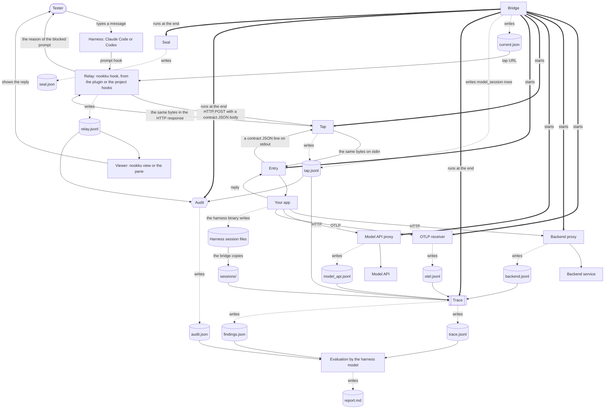
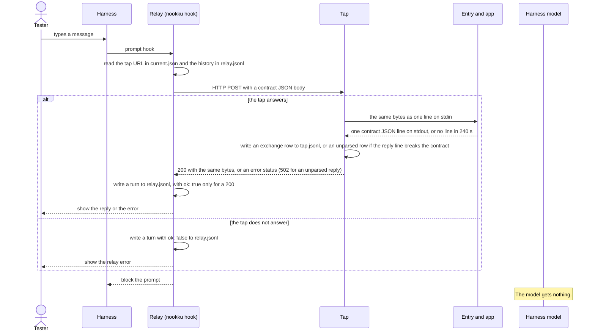
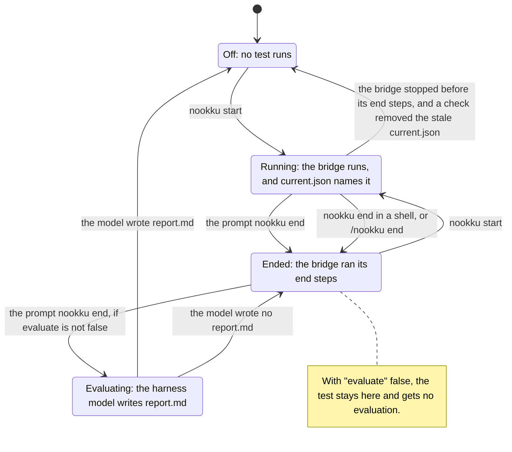
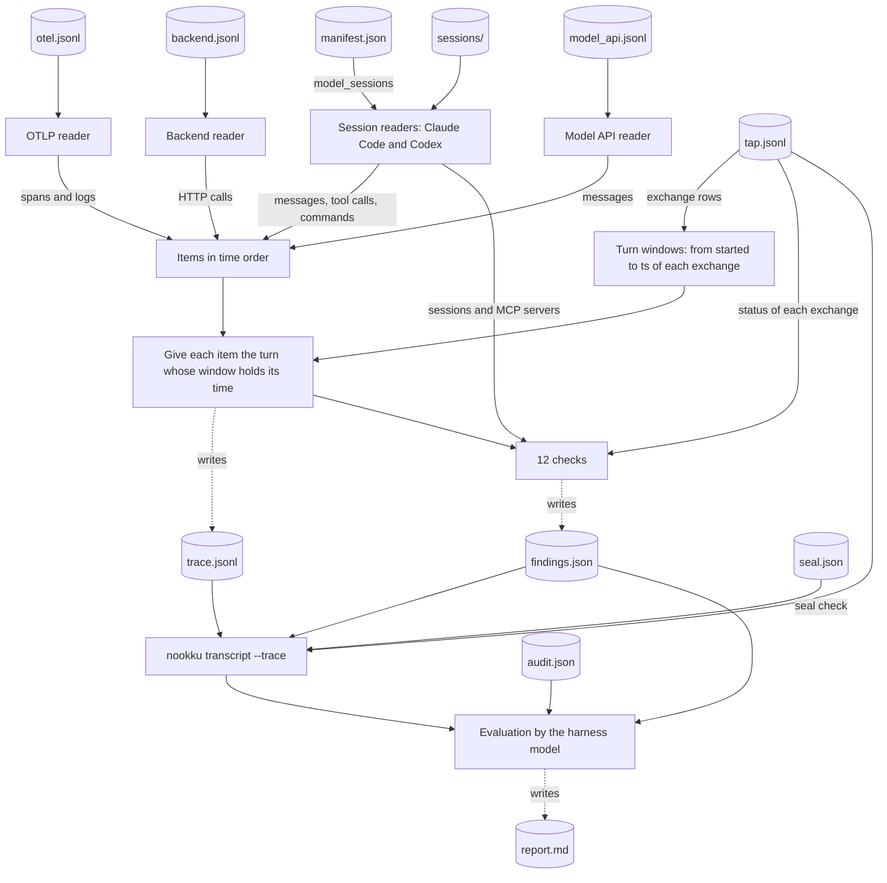

# Architecture

This page shows the parts of Nookku and how the data goes between them. [SPEC.md](../SPEC.md) defines each part exactly. This page tells you why each part exists and where to read more.

## The problem

A tester talks to a chat agent through a coding [harness](reference/glossary.md#harness): Claude Code or Codex. If the harness model carries the messages, it also writes them. Then it judges its own text. Nookku takes the model out of the conversation, and keeps 2 records that a third program can compare.

## Data flow

This diagram shows a test with an entry. With no entry, the relay sends each message to a tap in HTTP mode, and no bridge runs ([how-to/http-tap.md](how-to/http-tap.md)).

The solid lines carry the conversation and the data that a part reads. The dotted lines write a file. The thick lines show the parts that the bridge starts, and the steps that it runs at the end. The [relay](reference/glossary.md#relay), the [tap](reference/glossary.md#tap) and the proxies run on the tester's machine, on `127.0.0.1`.

The relay sends each message as an HTTP POST with a contract JSON body ([SPEC.md section 6](../SPEC.md#6-agent-contract-version-1)). The tap writes the same bytes as one line to the stdin of the entry. It sends the reply line back to the relay with no change.

## The relays

The relay is the command `nookku hook`. It carries each message and each reply, with one set of rules in Python. It has 2 forms, with the same 2 command hooks ([SPEC.md section 5](../SPEC.md#5-relays), [ADR 0001](adr/0001-one-core-one-plugin.md)):

- **The plugin.** One plugin folder for Claude Code and Codex. It also has the MCP server `nookku mcp`, with the read-only tools `transcript` and `status`, and the `setup` skill. In Claude Code, function hooks add `/nookku`, a status line and a pane. They are early access. They hold one rule: in relay mode, they drop a prompt with an attachment. Read [how-to/claude-code-plugin.md](how-to/claude-code-plugin.md) or [how-to/codex.md](how-to/codex.md).
- **The project hooks.** `nookku init` writes the same 2 hooks into one project. Read [how-to/claude-code-hook-kit.md](how-to/claude-code-hook-kit.md) or [how-to/codex.md](how-to/codex.md).

Both forms show each reply as the reason of a blocked prompt, and `nookku view` shows each reply in a second terminal. `codex exec` does not show the reason. In Codex, `nookku start` refuses a test if a nookku hook is not trusted ([SPEC.md section 7.8](../SPEC.md#78-codex-hook-gate)).

In [relay mode](reference/glossary.md#relay-mode), the relay takes each prompt before the model sees it. It sends the prompt to the tap and blocks it from the model. The relay also denies a model tool call that names the address of the tap or the agent. It also denies a call that changes the files of a test. The deny is best effort. [limits.md](limits.md) tells you what it does not stop.

A relay fails closed. If it cannot send a message, the message still does not go to the model. The relay shows the error and records it as a relay error ([SPEC.md section 5](../SPEC.md#5-relays)).

## The tap

The tap is a proxy between the relay and the agent. It forwards each request and each response with no change, and it writes the tap record. It has 2 modes ([SPEC.md section 4](../SPEC.md#4-tap)):

- **Stdio mode.** The tap starts the [entry](reference/glossary.md#entry) and speaks the [agent contract](reference/glossary.md#agent-contract) with it. A test uses this mode.
- **HTTP mode.** The tap is in front of an agent that is already an HTTP server. Read [how-to/http-tap.md](how-to/http-tap.md).

## The entry and the agent contract

The entry is a thin wrapper that starts your app and speaks the agent contract on stdin and stdout. The contract is one JSON line in for each message, and one JSON line out for each reply ([SPEC.md section 6](../SPEC.md#6-agent-contract-version-1)). The entry is test code, not app code. It is in `.nookku/`, and your app's code does not change.

This is the plumbing that a test needs. You write the entry once. You change it when the start or the wiring of your app changes. In Python, `nookku.agent.serve()` speaks the contract for one function. Read [how-to/connect-your-agent.md](how-to/connect-your-agent.md).

## One turn

This diagram shows one message in a test with an entry. The plugin and the project hooks run the same relay, so they do the same steps.

- If the agent sends an error, the tap sends status 500. If the agent sends no reply line in [240 seconds](#timeouts), the tap stops the agent and sends status 504 ([SPEC.md section 4.2](../SPEC.md#42-stdio-mode)).
- If the tap does not answer, for example because the bridge stopped, the relay writes the turn with `ok: false`. It still blocks the prompt, and the model gets nothing ([SPEC.md section 5](../SPEC.md#5-relays)).
- The relay writes the turn, and then shows the reply as the reason of the blocked prompt. The viewer shows it from `relay.jsonl`.
- The relay sends only the turns with `ok: true` as the history.

## The bridge

The [bridge](reference/glossary.md#bridge) is a background process that runs one test ([SPEC.md section 7.2](../SPEC.md#72-start-and-end)). `nookku start` starts it. The bridge then:

1. starts the OTLP receiver, the backend proxies and the model API proxies;
2. starts the entry through the tap in stdio mode;
3. watches for the Claude Code sessions that a process of the entry runs, and writes a `model_session` row to `tap.jsonl` for each one ([SPEC.md section 7.3](../SPEC.md#73-model-sessions)).

`nookku end` stops it. The bridge then:

1. stops the entry and the proxies;
2. finds the Codex sessions of the app, and writes a `model_session` row to `tap.jsonl` for each one;
3. copies each session file into the [test folder](reference/glossary.md#test-folder);
4. builds the [trace](reference/glossary.md#trace), writes `audit.json` and writes the [seal](reference/glossary.md#seal).

If the trace, the audit or the seal fails, the bridge writes the error to `bridge.log` and does the next step. The test still ends ([SPEC.md section 7.2](../SPEC.md#72-start-and-end)).

## The test lifecycle

This diagram shows the states of a test, and the steps that change the state.

- There are 2 ways to end a test ([SPEC.md section 9.1](../SPEC.md#91-start)). The prompt `nookku end` ends the test and starts the evaluation in one step. `nookku end` in a shell, or `/nookku end` in the plugin, ends the test with no evaluation.
- A later prompt `nookku end` starts the evaluation of the latest test, if that test ended and has no `report.md`. A new test with `nookku start` becomes the latest test, so the test before it gets no evaluation.
- If the configuration has `"evaluate": false`, no test gets an evaluation ([reference/config.md](reference/config.md#test-keys)).
- If the bridge stops before its end steps, `current.json` stays. `start`, `end` and `status` check if the bridge of `current.json` runs. If it does not run, they remove the stale file ([SPEC.md section 7.2](../SPEC.md#72-start-and-end)). The relay does this check before each prompt. A test with a stale `current.json` has no end time, so it gets no evaluation.

## The proxies and the receiver

These parts record what the app does to answer a message. Each one is independent of the app's code, except the OTLP receiver.

- **Backend proxies.** One recording proxy for each HTTP service of the app. The bridge gives the app the proxy URL in the service's environment variable ([SPEC.md section 7.6](../SPEC.md#76-backend-proxies)). Read [how-to/add-a-backend.md](how-to/add-a-backend.md).
- **Model API proxies.** One recording proxy for the Anthropic API and one for the OpenAI API, in `ANTHROPIC_BASE_URL` and `OPENAI_BASE_URL` ([SPEC.md section 7.7](../SPEC.md#77-model-api-proxies)).
- **OTLP receiver.** It takes the OpenTelemetry spans and logs of the app ([SPEC.md section 7.5](../SPEC.md#75-otlp-receiver)).

Read [how-to/record-model-calls.md](how-to/record-model-calls.md) for the last two. The proxies remove the values of secret headers and secret query parameters from the record, but forward them with no change.

## The model sessions

If your app runs its own Claude Agent SDK or Codex sessions, the harness binary writes a session file for each one. The test copies these files. They hold each tool call of the app's model, with its arguments and its result. The harness writes them, not your app, so their format can change between harness versions ([SPEC.md section 7.3](../SPEC.md#73-model-sessions)).

## The audit

The [audit](reference/glossary.md#audit) compares the relay record with the tap record ([SPEC.md section 3](../SPEC.md#3-audit)). It aligns the tester messages with the agent inputs, and then it compares each reply. It compares bytes. It does not normalize whitespace, line ends or Unicode. It reports 7 break classes: `altered_input`, `injected_input`, `duplicate_send`, `out_of_order`, `not_delivered`, `altered_reply` and `unshown_reply`.

The audit fails closed. If a record is missing or invalid, it exits with 2 and reports no result. It never reports clean on a record that it cannot read.

## The seal

At the end of a test, the bridge writes the SHA-256 of each file of the test folder to `seal.json`. It also writes a copy outside the project ([SPEC.md section 7.4](../SPEC.md#74-seal)). `nookku verify` shows each file that changed after the end. The seal does not stop a change. It makes a change visible.

## The trace and the findings

The trace, `trace.jsonl`, joins the session files, `otel.jsonl`, `backend.jsonl` and `model_api.jsonl` into one record. Each item has its turn and a pointer to its line in the source file ([SPEC.md section 8](../SPEC.md#8-trace)). 12 checks write `findings.json`, for example a tool call that failed or a turn in which no model ran ([SPEC.md section 8.6](../SPEC.md#86-findings)). The [findings](reference/glossary.md#findings) do not change the exit code of the audit.

- The bridge builds the trace at the end of a test, from the copied session files in `sessions/` and the list of model sessions in `manifest.json`.
- The window of a turn is from `started` to `ts` of its exchange row in `tap.jsonl`. An item in no window has no turn ([SPEC.md section 8.3](../SPEC.md#83-turns)).
- `nookku transcript --trace` shows each turn from `tap.jsonl`, with its items and its findings, and the result of the seal ([SPEC.md section 9.2](../SPEC.md#92-evaluation-prompt)).

## The evaluation

At the prompt `nookku end`, the relay ends the test and gives the harness model the [evaluation](reference/glossary.md#evaluation) prompt ([SPEC.md section 9](../SPEC.md#9-evaluation)). The model did not see the conversation while you talked. It reads the transcript with the trace, the findings and the audit. It reads your app's code and rules, and it checks the app's state with read-only commands. Then it writes `report.md`. After a test, the relay denies model writes to the test folder, except `report.md`.

A report is a model answer, so it can be wrong. [evaluation-example.md](evaluation-example.md) shows one report and what the model got wrong.

## Timeouts

Each wait on the relay path ends before the wait around it, so that the relay can still block the prompt ([SPEC.md section 4.3](../SPEC.md#43-timeouts)). The order is the agent, the tap, the relay and the hook. The test [tests/test_timeouts.py](../tests/test_timeouts.py) checks the order.

| Order | Wait | Seconds | Constant |
|---|---|---|---|
| 1 | The tap waits for the agent, in HTTP mode and in stdio mode. | [240](../src/nookku/stdio.py#L24) | `stdio.TIMEOUT` |
| 2 | The tap answers the relay, at most [5 seconds](../tests/test_timeouts.py#L21) after the agent timeout. | [245](../tests/test_timeouts.py#L21) | `stdio.TIMEOUT + ANSWER` |
| 3 | The relay waits for the tap of a test. | [270](../src/nookku/state.py#L21) | `state.TIMEOUT` |
| 3 | The relay waits for a tap in HTTP mode, with no test. | [280](../src/nookku/kit.py#L32) | `kit.TIMEOUT` |
| 4 | The harness stops the `UserPromptSubmit` hook of the relay. | [300](../src/nookku/kit.py#L35) | `kit.HOOK_DEADLINE` |

Each number links to its constant. The [5 seconds](../tests/test_timeouts.py#L21) of order 2 is the `ANSWER` limit of the test. The plugin and the project hooks run the same hook, so they have the same timeouts. [tests/test_docs.py](../tests/test_docs.py) checks that this table matches the constants.

## Where to read the code

| Part | Code |
|---|---|
| Relay and project hooks | [src/nookku/kit.py](../src/nookku/kit.py) |
| MCP server | [src/nookku/mcp.py](../src/nookku/mcp.py) |
| Codex hook gate | [src/nookku/codex_gate.py](../src/nookku/codex_gate.py) |
| Plugin | [plugins/nookku/hooks/hooks.json](../plugins/nookku/hooks/hooks.json), [nookku-hook.sh](../plugins/nookku/hooks/nookku-hook.sh), [.mcp.json](../plugins/nookku/.mcp.json), the display layer [register.tsx](../plugins/nookku/hooks/register.tsx) |
| Tap, HTTP mode | [src/nookku/tap.py](../src/nookku/tap.py), [adapters.py](../src/nookku/adapters.py) |
| Tap, stdio mode | [src/nookku/stdio.py](../src/nookku/stdio.py) |
| Agent contract | [src/nookku/contract.py](../src/nookku/contract.py), [agent.py](../src/nookku/agent.py) |
| Bridge | [src/nookku/bridge.py](../src/nookku/bridge.py) |
| Proxies and receiver | [backend.py](../src/nookku/backend.py), [model_api.py](../src/nookku/model_api.py), [otlp.py](../src/nookku/otlp.py) |
| Records and audit | [record.py](../src/nookku/record.py), [audit.py](../src/nookku/audit.py) |
| Seal | [seal.py](../src/nookku/seal.py) |
| Trace and evaluation | [trace.py](../src/nookku/trace.py), [evaluation.py](../src/nookku/evaluation.py), [evaluate.md](../src/nookku/evaluate.md) |
| Read check of the deny | [commands.py](../src/nookku/commands.py) |
