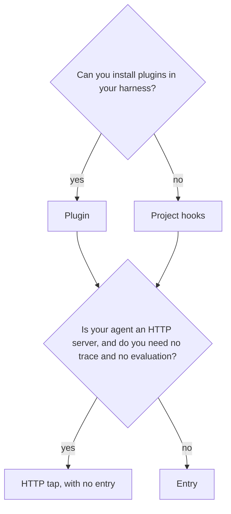

# Choose the plugin or the project hooks

The [relay](../reference/glossary.md#relay) carries each message to your agent and each reply back to you. It is one command, `nookku hook`, with one set of rules ([SPEC.md section 5](../../SPEC.md#5-relays)). You install it in one of 2 forms, in Claude Code or in Codex:

- **The plugin.** You install it one time with the plugin command of your harness. It works in each project that has a `.nookku/` folder.
- **The project hooks.** `nookku init claude-code` or `nookku init codex` writes the same 2 hooks into one project.

Use this page to select a form, and to select how the relay reaches your agent.

## Decision flow



1. Select the form:
   - Use the plugin if you can. It gives the model the `transcript` tool, and in Claude Code it adds `/nookku`, a status line and a pane. Read [claude-code-plugin.md](claude-code-plugin.md) or [codex.md](codex.md).
   - Use the project hooks if your harness or your company does not let you install plugins. Read [claude-code-hook-kit.md](claude-code-hook-kit.md) or [codex.md](codex.md).
2. Select how the relay reaches your agent:
   - If your agent is already an HTTP server, and you need no [trace](../reference/glossary.md#trace) and no [evaluation](../reference/glossary.md#evaluation), you can use the HTTP [tap](../reference/glossary.md#tap). Read [http-tap.md](http-tap.md).
   - Each other agent uses an [entry](../reference/glossary.md#entry). Read [connect-your-agent.md](connect-your-agent.md).

## Compare the 2 forms

| | Plugin | Project hooks |
|---|---|---|
| What it installs, and where | The plugin, with `claude plugin install` or `codex plugin add`. It works in each of your projects. `nookku init plugin` writes `.nookku/config.json`, or the `setup` skill writes it. | `nookku init` writes `.nookku/config.json`, `.nookku/mode` and [2 hooks](../../src/nookku/kit.py), in the project only. The hooks go in `.claude/settings.local.json` (Claude Code) or `.codex/hooks.json` (Codex). |
| The rules | `nookku hook`, from `PATH`. | `nookku hook`, with the Python of the install that wrote the hooks. |
| The start and end commands | The prompts `nookku start` and `nookku end`. In Claude Code, also `/nookku start` and `/nookku end`. | The prompts `nookku start` and `nookku end`. |
| Where the reply shows | In the chat, as the reason of a blocked prompt. In Claude Code, also in the Nookku pane (`/nookku view`). In Codex, also in `nookku view`, in a second terminal. | In the chat, as the reason of a blocked prompt, and in `nookku view`, in a second terminal. |
| How the model reads the transcript | With the read-only `transcript` tool of the MCP server `nookku mcp`, in pages. | With the command `nookku transcript`. |
| If `nookku` is not on `PATH` | The shell guard of the plugin blocks each prompt and denies each tool call in relay mode. | The hooks do not use `PATH`. If you move the install, run `nookku init` again. |

The plugin loads in Claude Code 2.1.295 and in Codex 0.162.0 ([data](../../proofs/plugin/load.json), [method](../../scripts/proof_plugin_load.py)). The proofs P1 to P4 ran on the project hooks in Claude Code 2.1.295 ([data](../../proofs/hooks-claude-code/results.json)) and in codex-cli 0.160.0 ([data](../../proofs/hooks-codex/results.json)).

Both forms run the same rules and give the model the same transcript text. Both fail closed: if the relay cannot send a message, the message does not go to the model. For both forms, the deny of model tool calls is best effort. In Codex, a person must trust the hooks of both forms, and `nookku start` refuses a test with an untrusted hook ([SPEC.md section 7.8](../../SPEC.md#78-codex-hook-gate)). [limits.md](../limits.md) gives each limit.

## Switch from one form to the other

**Warning:** Never use both forms in one project. If both run, each message goes to the agent two times, and the [audit](../reference/glossary.md#audit) reports a `duplicate_send` break ([SPEC.md section 3.3](../../SPEC.md#33-break-classes)). In Codex, `nookku start` refuses a test if both forms are on.

The 2 forms use the same `.nookku/config.json` and the same [test folders](../reference/glossary.md#test-folder). A switch keeps your entry and your old tests.

### From the plugin to the project hooks

1. End the running test. Run `nookku end` in a shell.
2. Disable the plugin in this project only:
   - In Claude Code, give `--scope local`. Without it, the command can disable the plugin at the user scope, and then the plugin stops in each project:

     ```bash
     claude plugin disable --scope local nookku@nookku
     ```

   - In Codex, remove the plugin with `codex plugin remove nookku@nookku`. This removes it from each project.
3. Write the project hooks. `init` keeps each key of an existing `.nookku/config.json`, also the entry:

   ```bash
   nookku init claude-code
   ```

   For Codex, run `nookku init codex`, then trust the hooks ([codex.md](codex.md#install)).

### From the project hooks to the plugin

1. End the running test. Run `nookku end` in a shell.
2. Remove the [2 hooks](../../src/nookku/kit.py) of nookku from `.claude/settings.local.json` or `.codex/hooks.json`. Their command contains `nookku hook`. Keep your other hooks. [remove.md](remove.md) gives the steps.
3. Install the plugin, or enable it again in this project. Do the steps of [claude-code-plugin.md](claude-code-plugin.md) or [codex.md](codex.md). Your `.nookku/config.json` stays.
